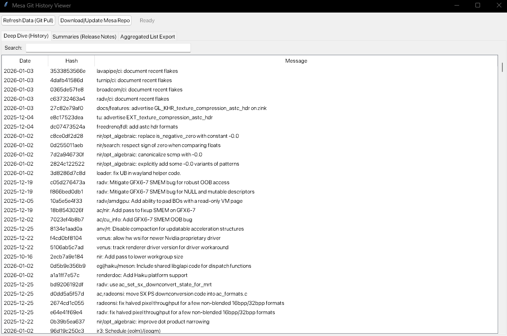
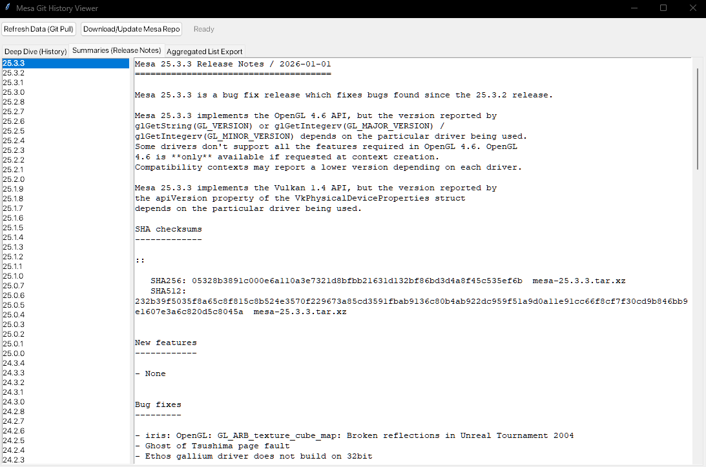
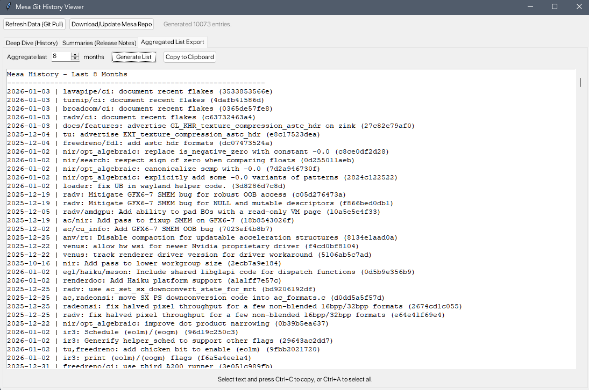

# Mesa Git History Viewer

A GUI desktop application written in Python for browsing the **Mesa3D** graphics library source history. It provides a local database and release notes viewer for tracking **OpenGL** and **Vulkan** driver changes, including **RADV**, **ANV**, and **Gallium3D**.

## Motivations

Mesa implements changes iteratively over many releases. For people who haven't consistently kept up with development, it's time consuming to search through every release's changelog, and the existing Git/terminal based solutions are clunky for non-developers. This tool lets you **Ctrl+F through the entire change history** within a specific timeframe to find changes instantly within a single, focused GUI for everyone.

Also includes a tool to dump the last X months of logs into a clean list—handy for exporting to other tools or parsing in your text editor.

```diff
+ ███╗   ███╗███████╗███████╗ █████╗
+ ████╗ ████║██╔════╝██╔════╝██╔══██╗
+ ██╔████╔██║█████╗  ███████╗███████║
+ ██║╚██╔╝██║██╔══╝  ╚════██║██╔══██║
+ ██║ ╚═╝ ██║███████╗███████║██║  ██║
+ ╚═╝     ╚═╝╚══════╝╚══════╝╚═╝  ╚═╝

- ██████╗ ██╗████████╗
- ██╔════╝ ██║╚══██╔══╝
- ██║  ███╗██║   ██║
- ██║   ██║██║   ██║
- ╚██████╔╝██║   ██║
-  ╚═════╝ ╚═╝   ╚═╝

+ ██╗  ██╗██╗███████╗████████╗ ██████╗ ██████╗ ██╗   ██╗
+ ██║  ██║██║██╔════╝╚══██╔══╝██╔═══██╗██╔══██╗╚██╗ ██╔╝
+ ███████║██║███████╗   ██║   ██║   ██║██████╔╝ ╚████╔╝
+ ██╔══██║██║╚════██║   ██║   ██║   ██║██╔══██╗  ╚██╔╝
+ ██║  ██║██║███████║   ██║   ╚██████╔╝██║  ██║   ██║
+ ╚═╝  ╚═╝╚═╝╚══════╝   ╚═╝    ╚═════╝ ╚═╝  ╚═╝   ╚═╝

- ██╗   ██╗██╗███████╗██╗    ██╗███████╗██████╗
- ██║   ██║██║██╔════╝██║    ██║██╔════╝██╔══██╗
- ██║   ██║██║█████╗  ██║ █╗ ██║█████╗  ██████╔╝
- ╚██╗ ██╔╝██║██╔══╝  ██║███╗██║██╔══╝  ██╔══██╗
-  ╚████╔╝ ██║███████╗╚███╔███╔╝███████╗██║  ██║
-   ╚═══╝  ╚═╝╚══════╝ ╚══╝╚══╝ ╚══════╝╚═╝  ╚═╝
```


## Features

### Changelog History
Local, searchable table of the last 12 months of commits. Type keywords, commit hashes, or file changes to instantly filter results.

### Release Notes (Summaries)
Parses the `.rst` files from the Mesa docs folder so you can read release notes side-by-side with the history.

### Aggregated List Export
Grab the last X months of history and dump it into a text box. One-click copy to paste into other tools.

## Screenshots

### Changelog History


### Release Notes (Summaries)


### Aggregated List Export


## Requirements

- **Python 3.9** or higher
- **Git** (in your PATH)
- **tkinter**
- **Supported on**: Windows, macOS, and Linux

For macOS (including Apple Silicon M1/M2/M3), ensure you have:
- **Homebrew** installed (https://brew.sh/)
- **Xcode Command Line Tools** (run `xcode-select --install` in Terminal)
- **Python 3.9+ with tkinter** (install via Homebrew: `brew install python`)

## Installation & Setup

### Step 1: Install Dependencies

Choose the script for your OS:

- **Windows**: Double-click `Install-Dependencies-Windows.bat`
- **Linux**: Run `bash Install-Dependencies-Linux.sh`
- **macOS**: Run `bash Install-Dependencies-Mac.sh`

### Step 2: Run the Viewer

Choose the script for your OS:

- **Windows**: Double-click `Run-Viewer-Windows.bat`
- **Linux**: Run `bash Run-Viewer-Linux.sh`
- **macOS**: Run `bash Run-Viewer-Mac.sh`

**On first launch** Click "Download/Update Mesa Repo" to fetch the Mesa source code (may take a few minutes on first run).


## Troubleshooting: Tcl/Tk and tkinter

If the app fails to start with an error about Tcl/Tk or "Can't find a usable init.tcl", follow these steps:

```bash
# Debian/Ubuntu
sudo apt install python3-tk

# Fedora
sudo dnf install python3-tkinter

# Arch
sudo pacman -S tk

# macOS
brew install python
# or ensure your Python distribution includes Tk support;
# ActiveTcl may be required in some setups

# macOS Apple Silicon (M1/M2/M3) specific issues:
# If you encounter tkinter issues on Apple Silicon:
# 1. Check your Python architecture:
python3 -c "import platform; print(platform.machine())"
# 2. Ensure you have ARM64 Python via Homebrew:
brew install python@3.11  # or latest version
# 3. If issues persist, reinstall Python:
brew uninstall python@3.11 && brew install python@3.11

# Windows
# Reinstall Python from python.org and ensure
# "Tcl/Tk and IDLE" is selected during installation
```

If you see a warning about Python version, install **Python 3.9+** to match the recommended testing configuration.

## Diagnostics & Quick Health Check

Run a diagnostic report to check Python, Tcl/Tk, Git, and project layout without starting the GUI:

```bash
python mesa_viewer.py --diagnose
```

This will print a summary and exit with a non-zero code if a fatal issue is detected.

You can also run an interactive helper to attempt remedial actions (like installing tkinter via your package manager):

```bash
python mesa_viewer.py --fix
```

Or combine both:

```bash
python mesa_viewer.py --diagnose --fix
```

## Usage

- **Filter commits**: Type keywords, file names, or hashes in the search bar (e.g., "radv", "fix", commit hash)
- **View release notes**: Click a version on the left pane to see what changed in that release
- **Export logs**: Go to "Aggregated List Export", set a month range, generate, and copy to clipboard

## Files

| File | Purpose |
|------|---------|
| `mesa_viewer.py` | Main application |
| `Mesa_Deep_Dive.txt` | Generated git log cache (git history) |
| `Mesa_Summaries.txt` | Generated release notes cache |
| `mesa/` | Mesa Git repository (auto-downloaded on first use) |

## License

This project has been released into the public domain. See [UNLICENSE](UNLICENSE) for details.

## Notes

This project was vibe coded with human oversight (in case it wasn't obvious.)
